# DataPrep 现有代码分析文档

## 1. 这份文档怎么读

这份文档是给“对机器学习不熟，但需要读懂当前代码是做什么的”这类读者准备的。

阅读目标不是让你先掌握论文，而是先回答四个问题：

1. 这套代码整体在做什么
2. 每个模块输入什么，输出什么
3. 算法大致原理是什么
4. 重要代码在哪里

## 1.1 一张图先看全局

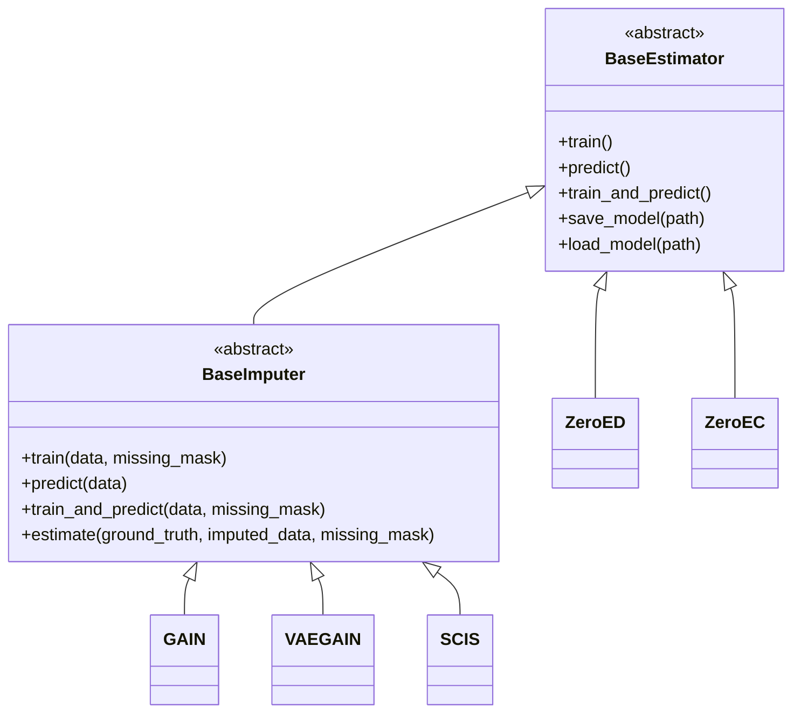

这张类图表达的是：

1. `BaseEstimator` 是所有算法共同祖先
2. `BaseImputer` 是补全任务专用抽象层
3. `GAIN`、`VAEGAIN`、`SCIS` 都走补全接口
4. `ZeroED` 和 `ZeroEC` 直接继承通用基类

## 2. 仓库结构总览

项目根目录下最重要的内容有：

1. `main.py`
2. `index.html`
3. `base.py`
4. `tabular/`
5. `datasets/`
6. `examples/`
7. `papers/`

### 2.1 `main.py`

文件位置：[main.py](D:/DataPrep/main.py:1)

它是系统后端入口，负责：

1. 启动 FastAPI
2. 接收前端请求
3. 调用算法
4. 做基线比较
5. 计算指标
6. 把结果回传给前端

可以把它理解成“系统总调度器”。

### 2.2 `index.html`

文件位置：[index.html](D:/DataPrep/index.html:1)

这是前端页面。它负责：

1. 显示三个任务页签
2. 让用户选择算法和参数
3. 展示日志、图表和结果表

可以把它理解成“控制面板”。

### 2.3 `tabular/`

这是算法核心目录，分成三类：

1. `tabular/imputation/`：缺失值补全
2. `tabular/detection/`：错误检测
3. `tabular/correction/`：数据修复

### 2.4 `papers/`

这里放了参考论文和论文原始代码：

1. `FATE_SIGIR25`
2. `DARN_VLDB25`

它们是后续整合的来源，但不是当前 Web 控制台已经接好的算法。

### 2.5 `examples/`

这里提供了最简单的脚本调用示例：

1. [examples/imputation.py](D:/DataPrep/examples/imputation.py:1)
2. [examples/detection.py](D:/DataPrep/examples/detection.py:1)
3. [examples/correction.py](D:/DataPrep/examples/correction.py:1)

## 3. 系统运行链路

系统的典型运行链路如下：

1. 用户在 `index.html` 里选任务和算法
2. 前端把路径和参数发给 `main.py`
3. `main.py` 读入 CSV
4. `main.py` 创建算法对象
5. 算法类内部调用训练和预测逻辑
6. `main.py` 再计算评估指标
7. 前端展示结果和日志

这意味着：

1. 算法真正干活的地方在 `tabular/*`
2. 任务组织和结果展示的地方在 `main.py` + `index.html`

### 3.1 Web 控制台主时序图

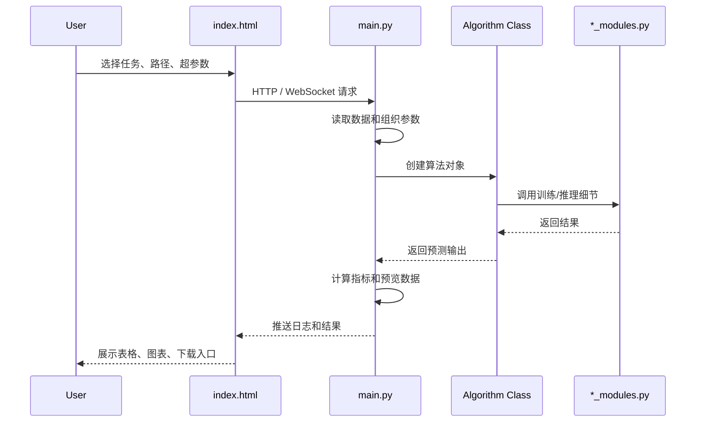

## 4. 基础抽象：为什么先看 `base.py`

### 4.1 `base.py`

文件位置：[base.py](D:/DataPrep/base.py:1)

这个文件定义了所有估计器的基础能力。

你可以把 `BaseEstimator` 理解成：

“以后不管是补全算法、检测算法还是修复算法，都尽量长成类似的样子。”

它规定了几个核心动作：

1. `train`：训练
2. `predict`：预测/转换
3. `train_and_predict`：先训练再预测
4. `save_model`：保存模型
5. `load_model`：加载模型
6. `_create_temp_dir`：创建临时目录
7. `_save_checkpoint`：保存 checkpoint

### 4.2 `tabular/imputation/base.py`

文件位置：[tabular/imputation/base.py](D:/DataPrep/tabular/imputation/base.py:1)

这是补全任务专用的抽象类。

它在 `BaseEstimator` 基础上补了两件事：

1. 补全任务默认的 `train_and_predict`
2. `estimate` 评估函数

`estimate` 做的事情很直接：

1. 只在原来缺失的位置比较真值和补全值
2. 计算 `RMSE`
3. 计算 `MAE`

如果你只想知道“补全结果好不好”，这里就是最重要的评估入口。

### 4.3 补全模块类关系图

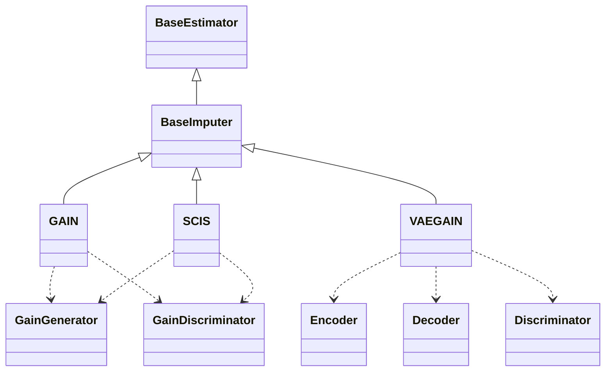

## 5. 补全模块代码分析

补全目录：[tabular/imputation](D:/DataPrep/tabular/imputation)

当前有三个算法：

1. `GAIN`
2. `VAEGAIN`
3. `SCIS`

它们的结构很像：

1. `*.py` 负责封装类、参数和对外接口
2. `*_modules.py` 负责神经网络和训练循环

### 5.1 GAIN 在做什么

相关文件：

1. [tabular/imputation/GAIN.py](D:/DataPrep/tabular/imputation/GAIN.py:1)
2. [tabular/imputation/GAIN_modules.py](D:/DataPrep/tabular/imputation/GAIN_modules.py:1)

#### 5.1.1 功能

输入：

1. 一个包含 `NaN` 的二维数组
2. 一个掩码矩阵

输出：

1. 一张补全后的完整二维数组

#### 5.1.2 原理

可以把 GAIN 理解成“两个人对抗”：

1. 生成器：负责猜出缺失值应该是什么
2. 判别器：负责判断某个位置到底是原始观测值，还是生成器补出来的值

训练目标是：

1. 生成器越来越会补
2. 判别器越来越难分辨真假

这样最后生成器就会学到更像真实数据的补全值。

#### 5.1.3 重要代码位置

1. `GAIN.__init__`：超参数和设备初始化
2. `GAIN.train`：训练入口
3. `GAIN.predict`：推理入口
4. `GainGenerator`：生成器网络
5. `GainDiscriminator`：判别器网络
6. `train_gain_algorithm`：完整训练循环

#### 5.1.4 你需要特别理解的点

1. 先做归一化，再训练神经网络
2. 缺失值位置训练前会先用 `0` 或随机噪声占位
3. 输出时再反归一化，恢复原始数值范围

#### 5.1.5 GAIN 训练时序图

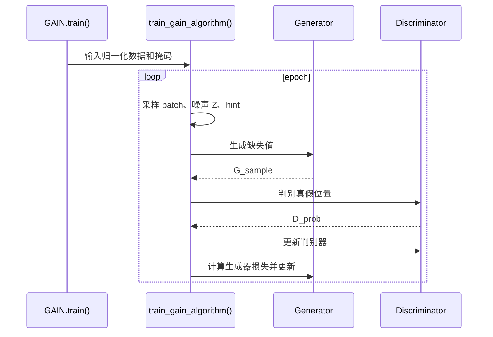

### 5.2 VAEGAIN 在做什么

相关文件：

1. [tabular/imputation/VAEGAIN.py](D:/DataPrep/tabular/imputation/VAEGAIN.py:1)
2. [tabular/imputation/VAEGAIN_modules.py](D:/DataPrep/tabular/imputation/VAEGAIN_modules.py:1)

#### 5.2.1 功能

和 `GAIN` 一样，也是缺失值补全。

#### 5.2.2 原理

可以把它理解为：

“GAIN + VAE”

这里比 `GAIN` 多了一层“潜在空间建模”：

1. 编码器把输入压缩成潜在表示
2. 解码器再从潜在表示恢复数据
3. 判别器继续做真假判断

这么做的意义是：

模型不仅在局部猜一个值，还尝试学习整张表背后的分布结构。

#### 5.2.3 重要代码位置

1. `Encoder`
2. `Decoder`
3. `Discriminator`
4. `gaussian_log_likelihood`
5. `train_vaegain`

#### 5.2.4 对非机器学习读者的直觉解释

如果说 `GAIN` 更像“补空题时根据上下文直接猜”，那么 `VAEGAIN` 更像：

1. 先推断这条记录大概属于哪类潜在模式
2. 再根据这种模式生成缺失值

#### 5.2.5 VAEGAIN 训练时序图

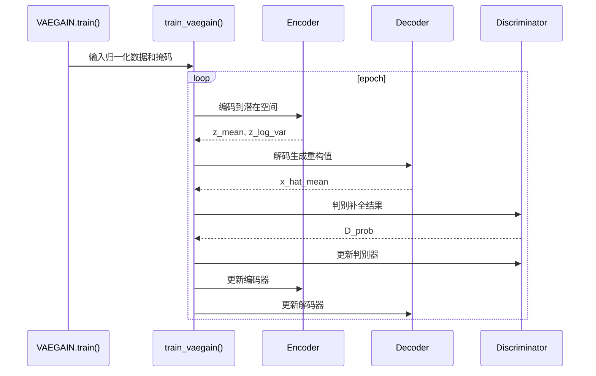

### 5.3 SCIS 在做什么

相关文件：

1. [tabular/imputation/SCIS.py](D:/DataPrep/tabular/imputation/SCIS.py:1)
2. [tabular/imputation/SCIS_modules.py](D:/DataPrep/tabular/imputation/SCIS_modules.py:1)

#### 5.3.1 功能

也是缺失值补全。

#### 5.3.2 原理

`SCIS` 是在 `GAIN` 基础上继续增强：

1. 保留生成器/判别器结构
2. 加入 `Sinkhorn` 距离，让补全后的分布更接近真实数据分布
3. 加入 Hessian 近似搜索，用于估计合适的训练样本量

#### 5.3.3 为什么它更复杂

它不是简单“一次训练到底”，而是三阶段：

1. 初始训练
2. 搜索样本量
3. 重训练

所以它比 `GAIN` 和 `VAEGAIN` 更重，代码也更难读。

#### 5.3.4 重要代码位置

1. `_train_step_gain`
2. `sinkhorn_loss_torch`
3. `compute_hessian_diag`
4. `train_scis_algorithm`

#### 5.3.5 SCIS 三阶段时序图

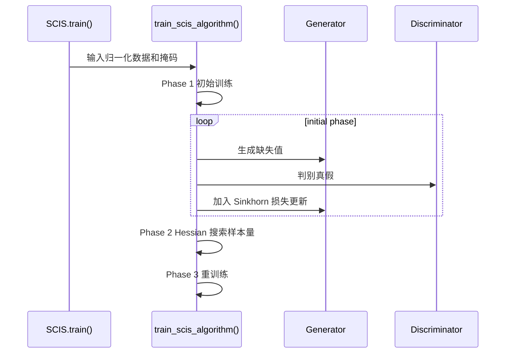

## 6. 检测模块代码分析

相关文件：

1. [tabular/detection/ZeroED.py](D:/DataPrep/tabular/detection/ZeroED.py:1)
2. [tabular/detection/ZeroED_modules.py](D:/DataPrep/tabular/detection/ZeroED_modules.py:1)

### 6.1 功能

输入：

1. 一张脏数据表

输出：

1. 一张布尔矩阵，表示哪些单元格是可疑错误

### 6.2 原理

`ZeroED` 不是一个单一神经网络，而是一条多步骤管线。

你可以把它理解成：

1. 先看整张表里哪些列彼此有关
2. 然后逐列建模
3. 可能结合局部模型、统计关系和 LLM 生成的规则
4. 最后输出每个单元格是否可疑

### 6.2.1 ZeroED 类图

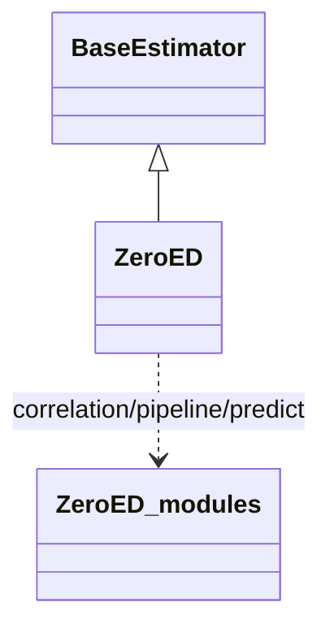

### 6.2.2 ZeroED 时序图

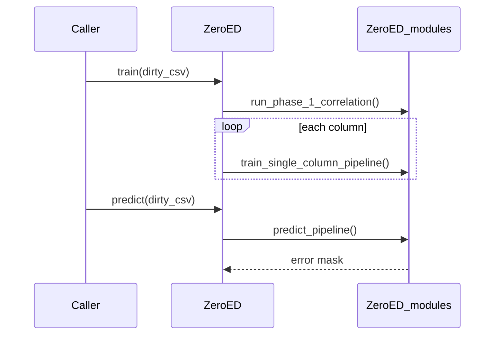

### 6.3 代码组织方式

`ZeroED.py` 比较薄，主要负责：

1. 接收参数
2. 初始化日志
3. 组织训练流程
4. 调用 `ZeroED_modules.py`

所以如果你要理解流程，先读 `ZeroED.py`；如果你要理解细节，再深入 `ZeroED_modules.py`。

### 6.4 重要代码位置

1. `ZeroED.train`
2. `run_phase_1_correlation`
3. `train_single_column_pipeline`
4. `ZeroED.predict`
5. `predict_pipeline`

## 7. 修复模块代码分析

相关文件：

1. [tabular/correction/ZeroEC.py](D:/DataPrep/tabular/correction/ZeroEC.py:1)
2. [tabular/correction/ZeroEC_modules.py](D:/DataPrep/tabular/correction/ZeroEC_modules.py:1)

### 7.1 功能

输入：

1. 脏数据
2. 错误位置矩阵
3. 干净真值
4. Prompt 和 embedding 模型

输出：

1. 修复后的数据表

### 7.2 原理

`ZeroEC` 更像一个“智能修复流水线”，不是一个单模型。

它的大体步骤是：

1. 为每列和样本建立 embedding 检索资源
2. 从已有数据里找相似上下文
3. 模拟人工修复少量样本，给后续提示做示范
4. 生成推理链、代码规则和依赖关系
5. 把错误单元格交给 LLM 做最终修复

### 7.2.1 ZeroEC 时序图

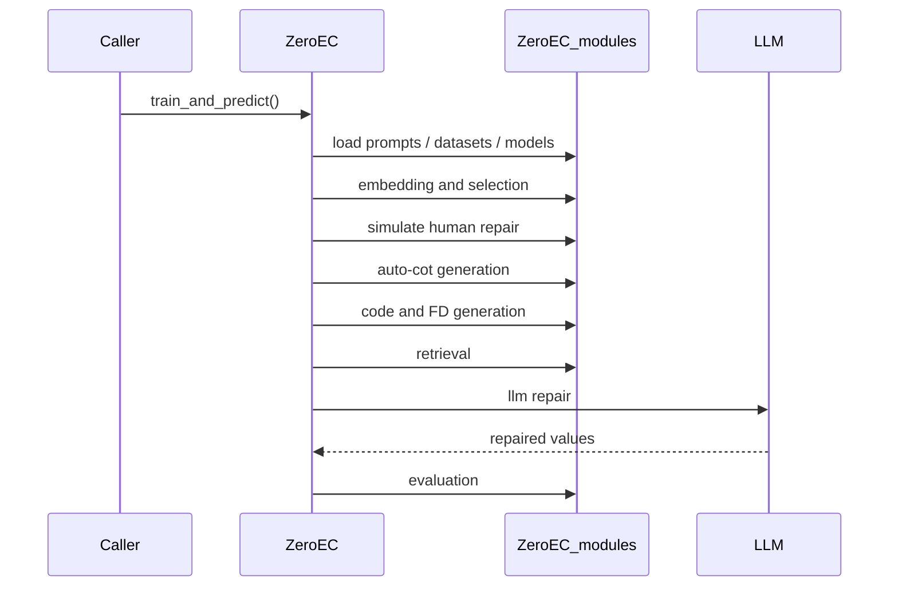

### 7.3 为什么依赖更重

因为它不仅要跑 Python 代码，还需要：

1. embedding 模型
2. 向量检索
3. prompt 模板
4. 兼容 OpenAI 接口的 LLM 服务

### 7.4 重要代码位置

1. `ZeroEC._initialize_resources`
2. `ZeroEC.train`
3. `ZeroEC.predict`
4. `run_embedding_and_selection`
5. `simulate_human_repair`
6. `run_auto_cot_generation`
7. `run_code_fd_generation`
8. `run_llm_repair`

## 8. 后端服务代码分析

文件位置：[main.py](D:/DataPrep/main.py:1)

这是最值得先读的文件之一，因为它告诉你“系统如何把模块串起来”。

### 8.1 `/api/preview`

位置：[main.py](D:/DataPrep/main.py:241)

作用：

1. 读取 CSV
2. 返回前 1000 行预览
3. 统计每列类型、缺失数、均值、方差等

### 8.2 `/api/ws/run_task`

位置：[main.py](D:/DataPrep/main.py:278)

作用：

1. 接收前端发来的任务参数
2. 根据 `method` 选择算法
3. 运行训练和预测
4. 把日志通过 WebSocket 实时发回前端

### 8.3 为什么这里很重要

因为这里集中写了三类任务的完整执行路径：

1. 数据怎么读
2. 基线怎么跑
3. 项目算法怎么实例化
4. 指标怎么算
5. 结果怎么组织给前端

如果你要快速定位“某个算法在哪里被调用”，这里就是第一入口。

### 8.4 后端调度类图

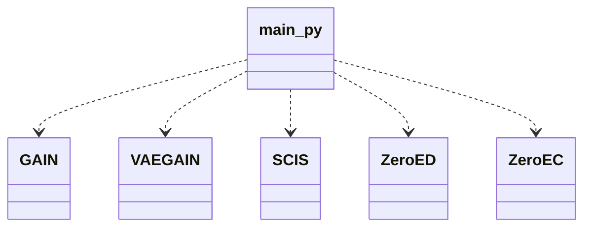

## 9. 前端代码分析

文件位置：[index.html](D:/DataPrep/index.html:1)

你不需要先精读全部 HTML。建议重点看三块：

1. 方法选择下拉框
2. 超参数表单
3. WebSocket 任务提交逻辑

当前补全算法挂载位置大致在：

1. 算法下拉框选项
2. `hyperparams` 默认参数对象
3. 结果展示区域

这也是后续集成 `FATE` 和 `DARN` 时需要改的地方。

## 10. 示例和测试

### 10.1 示例

目录：[examples](D:/DataPrep/examples)

建议先看：

1. [examples/imputation.py](D:/DataPrep/examples/imputation.py:1)
2. [examples/detection.py](D:/DataPrep/examples/detection.py:1)
3. [examples/correction.py](D:/DataPrep/examples/correction.py:1)

它们是最简单的调用样例。

### 10.2 测试

目录：[tabular/test](D:/DataPrep/tabular/test)

这里的测试主要有两类：

1. `unit_*`：单元测试，偏内部组件
2. `test_*`：集成式或功能式测试

对初学者来说，测试还有一个额外价值：

可以反向帮助你理解“这个类应该怎么被调用”。

## 11. 论文代码和当前项目代码的关系

目录：[papers](D:/DataPrep/papers)

需要特别说明：

1. `papers/FATE_SIGIR25` 和 `papers/DARN_VLDB25` 是参考资料和论文原始代码
2. 它们不是当前 Web 控制台已经接入的算法
3. 论文代码的主任务和当前 `imputation` 的接口并不完全一致

### 11.1 后续整合位置图

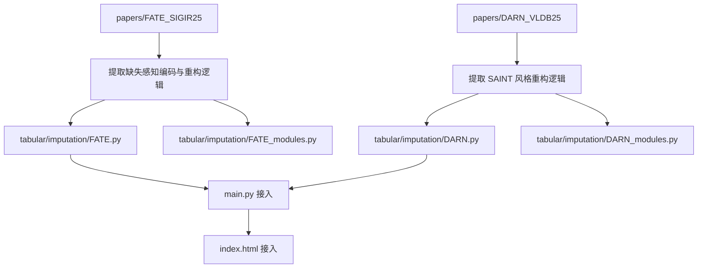

## 12. 建议阅读顺序

如果你想快速建立全局理解，推荐顺序如下：

1. [README.md](D:/DataPrep/README.md:1)
2. [main.py](D:/DataPrep/main.py:1)
3. [base.py](D:/DataPrep/base.py:1)
4. [tabular/imputation/base.py](D:/DataPrep/tabular/imputation/base.py:1)
5. [examples/imputation.py](D:/DataPrep/examples/imputation.py:1)
6. [tabular/imputation/GAIN.py](D:/DataPrep/tabular/imputation/GAIN.py:1)
7. [tabular/imputation/GAIN_modules.py](D:/DataPrep/tabular/imputation/GAIN_modules.py:1)
8. [tabular/detection/ZeroED.py](D:/DataPrep/tabular/detection/ZeroED.py:1)
9. [tabular/correction/ZeroEC.py](D:/DataPrep/tabular/correction/ZeroEC.py:1)

## 13. 一句话总结

这套代码的本质不是“一个单独的机器学习模型”，而是一个把多种表格数据治理算法统一到同一套调用和展示框架里的工程化项目。

理解它的关键不是先啃论文，而是先看清：

1. 统一接口怎么定义
2. 任务调度怎么串起来
3. 每类算法的输入输出是什么
4. 算法细节被放在哪一层

