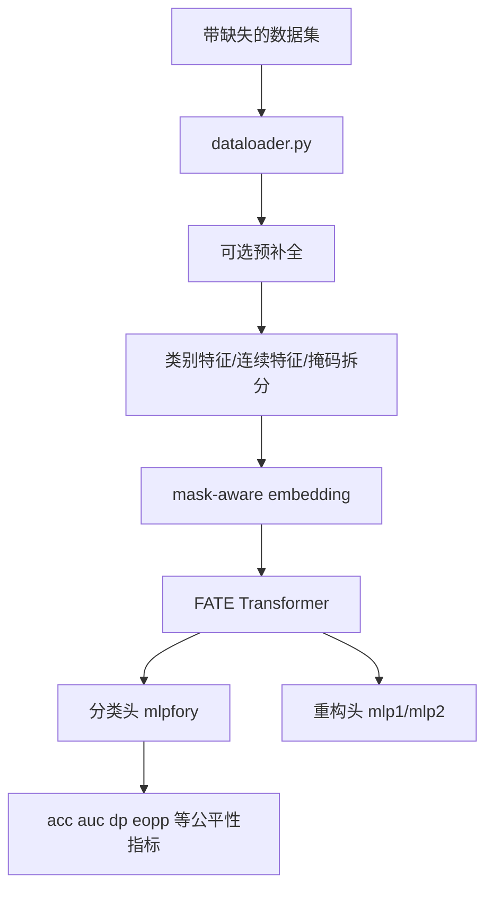
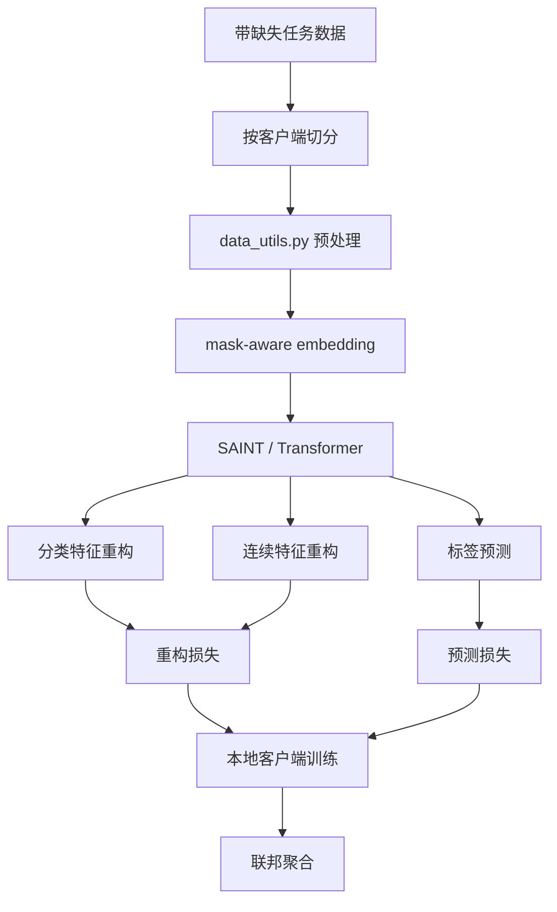
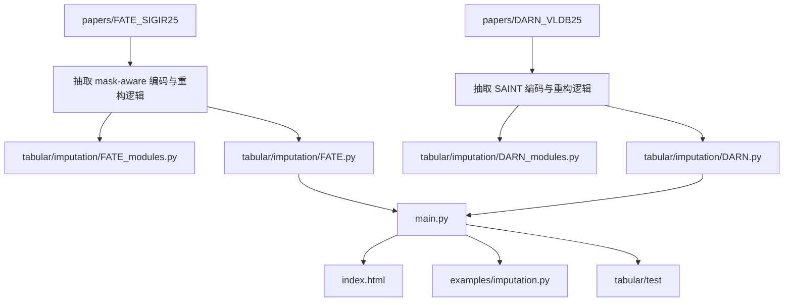

# FATE / DARN 原始论文代码解读与整合路线专项文档

## 1. 文档目的

本文档专门回答三个问题：

1. `papers/FATE_SIGIR25` 和 `papers/DARN_VLDB25` 原始代码到底在做什么
2. 它们和当前 `DataPrep` 的 `imputation` 模块有什么差异
3. 后续应该怎样整合，才既尽量忠于论文思路，又不破坏当前工程结构

## 2. 先说结论

最重要的结论是：

1. `FATE` 原始代码的主任务不是“单独的缺失值补全”，而是“缺失数据上的公平分类”
2. `DARN` 原始代码的主任务不是“单机缺失值补全”，而是“联邦场景下的不完整表格预测”
3. 因此，不能把论文主程序直接复制进当前 `imputation` 模块
4. 更合理的方案是提取它们内部真正与“缺失感知建模、特征恢复、重构输出”相关的部分，做成 `DataPrep` 风格的 imputer

## 3. FATE 原始代码解读

### 3.1 目录结构

重点目录：

1. [papers/FATE_SIGIR25/README.md](D:/DataPrep/papers/FATE_SIGIR25/README.md:1)
2. [papers/FATE_SIGIR25/code/args.py](D:/DataPrep/papers/FATE_SIGIR25/code/args.py:1)
3. [papers/FATE_SIGIR25/code/run.py](D:/DataPrep/papers/FATE_SIGIR25/code/run.py:1)
4. [papers/FATE_SIGIR25/code/dataloader.py](D:/DataPrep/papers/FATE_SIGIR25/code/dataloader.py:1)
5. [papers/FATE_SIGIR25/code/model.py](D:/DataPrep/papers/FATE_SIGIR25/code/model.py:1)

### 3.2 从入口看它在做什么

FATE 的主入口是 [run.py](D:/DataPrep/papers/FATE_SIGIR25/code/run.py:1) 中的 `run_FATE(args)`。

从主流程能看出它的完整任务是：

1. 读取带缺失的公平学习数据集
2. 先选择一种补全方式对输入做预处理
3. 把分类特征、连续特征和缺失掩码编码成 Transformer 可处理的形式
4. 训练 `FATE` 模型做分类
5. 用准确率和公平性指标评估结果

所以，FATE 关注的是：

1. 缺失条件下分类是否准确
2. 缺失条件下分类是否公平

而不是只关心“缺失值有没有被补得准”。

### 3.3 `args.py` 告诉我们的关键信息

文件：[papers/FATE_SIGIR25/code/args.py](D:/DataPrep/papers/FATE_SIGIR25/code/args.py:1)

这里能直接看到三个重要事实：

1. 有 `target` 和 `sensitive` 参数，说明模型服务于标签预测和公平性分析
2. 有 `imputation_method` 参数，说明补全是外部可替换的一个阶段
3. 大量参数都围绕分类训练和公平性评估，而不是围绕重构误差

### 3.4 `dataloader.py` 在做什么

文件：[papers/FATE_SIGIR25/code/dataloader.py](D:/DataPrep/papers/FATE_SIGIR25/code/dataloader.py:1)

这个文件决定了 FATE 如何组织数据。它主要负责：

1. 读取训练/验证/测试集
2. 拆出目标列和敏感属性列
3. 构造缺失掩码
4. 先执行某种补全方法
5. 拆分类别特征和连续特征
6. 返回给 Transformer 风格模型使用的数据结构

这里要特别注意：

`imputation_method` 在原始实现中支持 `mean`、`zero`、`miwae`、`notmiwae`、`gain`、`mice`。

这说明：

FATE 原论文里，“补全”主要是为下游分类服务，而不是最终目标本身。

### 3.5 `model.py` 里的 `FATE` 是什么

文件：[papers/FATE_SIGIR25/code/model.py](D:/DataPrep/papers/FATE_SIGIR25/code/model.py:369)

`FATE` 模型本质上是一个缺失感知的表格 Transformer，带有这些关键部件：

1. 类别特征 embedding
2. 连续特征 MLP embedding
3. 缺失掩码 embedding
4. Transformer 编码主干
5. 分类输出头 `mlpfory`
6. 特征重构头 `mlp1` / `mlp2`

这点很关键：

虽然原始任务是分类，但模型内部其实已经具备“恢复特征”的结构。

### 3.6 FATE 原始代码的数据流图

### 3.7 对当前项目最有价值的部分

如果目标是接入 `imputation`，最有价值的部分是：

1. `mask_embeds_cat` / `mask_embeds_cont`
2. 连续特征 embedding 方式
3. 缺失感知 Transformer 主干
4. `mlp1` / `mlp2` 重构头

### 3.8 不适合直接搬运的部分

不建议直接照搬：

1. 公平分类训练循环
2. 敏感属性处理逻辑
3. fairness 指标
4. 面向公平学习数据集的数据读取方式

## 4. DARN 原始代码解读

### 4.1 目录结构

重点目录：

1. [papers/DARN_VLDB25/DARN-main/README.md](D:/DataPrep/papers/DARN_VLDB25/DARN-main/README.md:1)
2. [papers/DARN_VLDB25/DARN-main/train_DARN.py](D:/DataPrep/papers/DARN_VLDB25/DARN-main/train_DARN.py:1)
3. [papers/DARN_VLDB25/DARN-main/utils/data_utils.py](D:/DataPrep/papers/DARN_VLDB25/DARN-main/utils/data_utils.py:1)
4. [papers/DARN_VLDB25/DARN-main/utils/util.py](D:/DataPrep/papers/DARN_VLDB25/DARN-main/utils/util.py:1)
5. [papers/DARN_VLDB25/DARN-main/models/model.py](D:/DataPrep/papers/DARN_VLDB25/DARN-main/models/model.py:1)
6. [papers/DARN_VLDB25/DARN-main/models/pretrainmodel.py](D:/DataPrep/papers/DARN_VLDB25/DARN-main/models/pretrainmodel.py:1)
7. [papers/DARN_VLDB25/DARN-main/models/build.py](D:/DataPrep/papers/DARN_VLDB25/DARN-main/models/build.py:1)

### 4.2 从主入口看它在做什么

主入口是 [train_DARN.py](D:/DataPrep/papers/DARN_VLDB25/DARN-main/train_DARN.py:1)。

主流程大致是：

1. 读取带缺失任务数据
2. 把数据切成多个客户端
3. 每个客户端本地训练
4. 用缺失模式互补性来指导联邦聚合
5. 持续评估预测性能

所以 DARN 的核心不是“补全一张表”，而是：

1. 多客户端协作学习
2. 不同客户端缺失模式的互补利用
3. 联邦表格预测

### 4.3 `utils/data_utils.py` 在做什么

文件：[papers/DARN_VLDB25/DARN-main/utils/data_utils.py](D:/DataPrep/papers/DARN_VLDB25/DARN-main/utils/data_utils.py:1)

这个文件非常重要，因为它定义了 DARN 的输入组织方式：

1. 自动区分类别列和连续列
2. 生成缺失掩码
3. 对类别列编码
4. 对连续列做基础填充
5. 按客户端和数据划分构造数据集
6. 提供 `embed_data_mask`

这里可以看到：

DARN 同样非常强调“mask-aware”特征编码。

### 4.4 `models/build.py` 和 `pretrainmodel.py` 说明了什么

文件：

1. [papers/DARN_VLDB25/DARN-main/models/build.py](D:/DataPrep/papers/DARN_VLDB25/DARN-main/models/build.py:1)
2. [papers/DARN_VLDB25/DARN-main/models/pretrainmodel.py](D:/DataPrep/papers/DARN_VLDB25/DARN-main/models/pretrainmodel.py:1)

从 `build.py` 可以看到，DARN 实际构建的是一个 `SAINT` 风格模型。

而 `pretrainmodel.py` 中的 `SAINT` 也带有：

1. 类别和连续特征 embedding
2. 缺失掩码 embedding
3. Transformer 编码器
4. 分类特征重构头
5. 连续特征重构头
6. 标签预测头

这意味着：

DARN 内部真正和补全最相关的部分，也是在这个 SAINT 风格骨架里。

### 4.5 `train_DARN.py` 里和补全最相关的逻辑

在训练时，DARN 会：

1. 取出 `x_categ`、`x_cont`
2. 取出 `cat_mask`、`con_mask`
3. 用 `embed_data_mask` 做缺失感知编码
4. 用 Transformer 得到表征
5. 用重构头预测原始特征
6. 用预测头输出标签

训练损失同时包含：

1. 标签预测损失
2. 连续特征重构损失
3. 分类特征重构损失

这说明 DARN 的“补全能力”是存在的，但目前是嵌在联邦预测任务里的。

### 4.6 DARN 原始代码的数据流图

### 4.7 对当前项目最有价值的部分

如果目标是接入 `imputation`，最值得抽取的是：

1. `embed_data_mask`
2. SAINT 风格编码器
3. 分类特征重构头
4. 连续特征重构头

### 4.8 不适合直接搬运的部分

不建议直接照搬：

1. 联邦客户端切分
2. 模型聚合逻辑
3. 缺失互补性加权聚合
4. 标签预测主任务训练循环
5. 固定数据路径和实验记录逻辑

## 5. 它们和当前 DataPrep 的差异

### 5.1 当前 `DataPrep imputation` 的接口

当前补全模块接口很明确：

1. 输入：`data_missing`, `missing_mask`
2. 输出：补全后的完整矩阵
3. 评估：`RMSE`、`MAE`

### 5.2 FATE 原始接口

原始 FATE 更像：

1. 输入：带标签、带敏感属性、带缺失的任务数据
2. 输出：分类性能和公平性指标
3. 补全：只是训练前或训练中的一个组成部分

### 5.3 DARN 原始接口

原始 DARN 更像：

1. 输入：多客户端带缺失任务数据
2. 输出：联邦预测性能
3. 补全：作为内部重构目标存在

### 5.4 结论

因此，这两篇论文的原始工程都不能直接塞进当前 `BaseImputer` 接口。

## 6. 推荐整合路线

### 6.1 总体原则

建议遵守四条原则：

1. 保留论文里真正与缺失感知补全有关的结构
2. 删除与当前目标不一致的下游任务逻辑
3. 统一成 `BaseImputer` 接口
4. 先做最小可运行版本，再做增强版

### 6.2 FATE 的整合方案

把 FATE 改造成：

“一个基于 mask-aware Transformer 的单机补全器”

建议保留：

1. 类别/连续特征 embedding
2. mask embedding
3. Transformer 主干
4. 重构头

建议去掉：

1. 分类主任务
2. 敏感属性逻辑
3. fairness 指标

建议新增文件：

1. `tabular/imputation/FATE.py`
2. `tabular/imputation/FATE_modules.py`

### 6.3 DARN 的整合方案

把 DARN 改造成：

“一个基于 SAINT 风格缺失感知编码器的单机补全器”

建议保留：

1. `embed_data_mask`
2. SAINT 编码骨架
3. 重构头

建议去掉：

1. 联邦训练
2. 客户端切分
3. 模型聚合
4. 标签预测主任务

建议新增文件：

1. `tabular/imputation/DARN.py`
2. `tabular/imputation/DARN_modules.py`

## 7. 推荐实施顺序

建议顺序如下：

1. 先实现 `FATE` 补全版
2. 跑通最小数据集
3. 再实现 `DARN` 补全版
4. 最后统一接入 `main.py` 和 `index.html`

原因是：

1. FATE 比 DARN 少了一层联邦复杂度
2. DARN 要剥离的工程噪声更多

## 8. 开发路线图

### 阶段 1：确认第一版支持范围

先明确：

1. 第一版是否只支持连续特征
2. 第一版是否同时处理分类特征
3. 第一版是否只跑数值型 CSV

### 阶段 2：实现 FATE 最小版

目标：

1. 新增 `FATE.py`
2. 新增 `FATE_modules.py`
3. 支持 `train/predict/train_and_predict`
4. 在现有数据或合成数据上跑通

### 阶段 3：接入主工程

目标：

1. `main.py` 新增方法分支
2. `index.html` 新增算法选项和参数区
3. `examples/imputation.py` 增加示例

### 阶段 4：实现 DARN 最小版

目标：

1. 新增 `DARN.py`
2. 新增 `DARN_modules.py`
3. 去掉联邦逻辑，只保留单机重构

### 阶段 5：测试和文档

目标：

1. 增加单元测试
2. 更新 README
3. 更新使用文档

## 9. 最终接入结构图

## 10. 2-4 周可执行路线图

### 10.1 交付范围建议

为了在 2-4 周内稳定完成，建议第一版明确收缩为：

1. `FATE` 和 `DARN` 都先实现为单机 `BaseImputer`
2. 第一版优先支持数值型表格补全
3. 分类特征先不做完整论文级处理，只保留接口扩展位置
4. 不接入 FATE 的公平分类任务
5. 不接入 DARN 的联邦客户端训练和聚合
6. 验收重点放在“能训练、能预测、能接 Web、能和现有补全算法一起评估”

这样做的原因是：当前 `DataPrep` 的补全接口和评估体系都是数值矩阵补全，先把论文里的缺失感知重构思想稳定接进来，比一次性恢复论文全部任务更可控。

### 10.2 两周冲刺版

如果目标是 2 周内出可演示版本，建议这样排：

| 时间 | 目标 | 主要任务 | 验收 |
| --- | --- | --- | --- |
| 第 1-2 天 | 代码确认 | 精读 `GAIN.py` / `GAIN_modules.py`、`FATE model.py`、`DARN pretrainmodel.py`，确认输入输出、mask 语义、训练损失 | 写出 FATE/DARN 模块级实现清单 |
| 第 3-5 天 | FATE 最小补全版 | 新增 `FATE.py`、`FATE_modules.py`，实现数值输入、mask embedding、Transformer、重构损失、反归一化 | 合成数据可跑通 `train_and_predict` |
| 第 6-7 天 | FATE 接入工程 | 接入 `main.py`、`index.html`、`examples/imputation.py` | Web 控制台可选择 FATE 并返回 MSE/RMSE/MAE |
| 第 8-10 天 | DARN 最小补全版 | 新增 `DARN.py`、`DARN_modules.py`，抽取 SAINT 风格编码器和重构头，去掉联邦逻辑 | 合成数据可跑通 `train_and_predict` |
| 第 11-12 天 | DARN 接入工程 | 接入 `main.py`、`index.html`、示例 | Web 控制台可选择 DARN 并返回 MSE/RMSE/MAE |
| 第 13-14 天 | 收尾验收 | 补单元/烟测、更新 README 和用户指南、整理已知限制 | 两个算法均可在小数据集完整跑通 |

两周版的取舍是：功能能演示，论文特性不完全恢复，分类特征和高级参数调优后置。

### 10.3 四周稳妥版

如果目标是 4 周内做得更稳，建议这样排：

| 周期 | 目标 | 主要任务 | 验收 |
| --- | --- | --- | --- |
| 第 1 周 | 读懂和定稿设计 | 精读现有 imputation、FATE、DARN；确认数值版输入输出；确定通用预处理、归一化、mask 语义、配置参数 | 形成实现设计和最小测试数据 |
| 第 2 周 | FATE 实现与接入 | 完成 FATE 单机补全版、训练/预测、保存必要状态、接入后端和前端 | FATE 在至少 1 个真实数据集和 1 个合成数据集跑通 |
| 第 3 周 | DARN 实现与接入 | 完成 DARN 单机补全版，抽离 SAINT 重构逻辑，接入后端和前端 | DARN 在同样数据集跑通，并可和 FATE/GAIN 对比 |
| 第 4 周 | 质量和文档 | 补测试、异常处理、默认参数、性能小调、更新文档和限制说明 | Web、示例、测试、README/用户指南一致 |

四周版更推荐，因为 DARN 原始代码的联邦训练噪声比较多，第三周单独留给它会更稳。

### 10.4 每周检查点

建议每周至少检查一次：

1. 当前新增算法是否仍遵守 `BaseImputer.train(data, missing_mask)` / `predict(data)`
2. `missing_mask` 是否始终保持 `1=observed, 0=missing`
3. 输出 shape 是否和输入完全一致
4. 原观测位置是否保持原值，缺失位置才被替换
5. `estimate()` 是否只在缺失位置计算 `MSE` / `RMSE` / `MAE`
6. Web 控制台参数是否和 Python 类初始化参数一致
7. README、用户指南、专项计划是否没有把未实现能力写成已实现

### 10.5 推荐优先级

优先级建议如下：

1. P0：FATE 数值版补全器可跑通
2. P0：DARN 数值版补全器可跑通
3. P0：`main.py` 和 `index.html` 可选择并运行两个新算法
4. P1：示例脚本和 smoke test
5. P1：文档更新和已知限制说明
6. P2：分类特征支持
7. P2：论文级超参数和消融实验复现
8. P3：恢复 DARN 联邦聚合或 FATE 公平分类相关能力

## 11. 风险与注意事项

### 11.1 任务语义漂移风险

论文里有效的训练目标，不一定直接适用于“纯补全任务”。

所以：

1. 不要默认论文参数能直接得到好补全结果
2. 需要重新定义补全版损失函数和评估方式

### 11.2 特征类型复杂度风险

当前 `DataPrep` 的补全接口几乎默认输入是数值矩阵。

而 FATE / DARN 原始工程对：

1. 分类特征
2. 连续特征
3. 掩码

是分开处理的。

这意味着第一版最好先收缩范围，避免一次把问题做得太大。

### 11.3 工程依赖复杂度风险

尤其 DARN 原始工程里联邦训练状态很多，直接搬运只会把复杂度带进来，不会直接提升当前项目的可用性。

## 12. 一句话建议

如果目标是把两篇论文真正整合进 `DataPrep imputation`，最合理的路线不是搬运论文主程序，而是：

1. 抽取缺失感知编码和重构能力
2. 重写成 `BaseImputer` 风格
3. 先做单机版
4. 再按需要逐步恢复更复杂的论文特性

